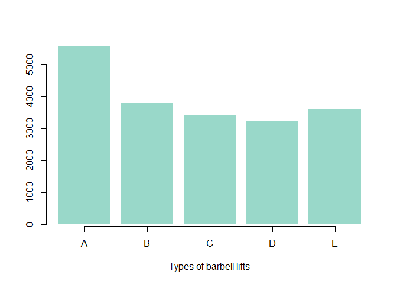

# Training
Coursera2015  
Thursday, February 19, 2015  
The goal is to use data from accelerometers on the belt, forearm, arm, and dumbell of 6 participants. They were asked to perform barbell lifts correctly and incorrectly in 5 different ways.

1. exactly according to the specication (Class A)  
2. throwing the elbows to the front (Class B)  
3. lifting the dumbbell only halfway (Class C)  
4. lowering the dumbbell only halfway (Class D)  
5. throwing the hips to the front (Class E)  
More information is available from the website here: http://groupware.les.inf.puc-rio.br/har  

###Data source  
The training data for this project are available here: https://d396qusza40orc.cloudfront.net/predmachlearn/pml-training.csv. The test data are available here:https://d396qusza40orc.cloudfront.net/predmachlearn/pml-testing.csv. 
The goal of the project is to predict the manner in which participants did the exercise. This is the "classe" variable in the training set.

###Download libraries and data 

```r
library(caret)
```

```
## Loading required package: lattice
## Loading required package: ggplot2
```

```r
library(parallel)
library(doParallel)
```

```
## Loading required package: foreach
## Loading required package: iterators
```

```r
library(randomForest)
```

```
## randomForest 4.6-10
## Type rfNews() to see new features/changes/bug fixes.
```

```r
library(dplyr)
```

```
## 
## Attaching package: 'dplyr'
## 
## The following object is masked from 'package:randomForest':
## 
##     combine
## 
## The following object is masked from 'package:stats':
## 
##     filter
## 
## The following objects are masked from 'package:base':
## 
##     intersect, setdiff, setequal, union
```

```r
#The training data 
training_file <- "pml-training.csv"
if(!file.exists(training_file)){
  url_1 <- "https://d396qusza40orc.cloudfront.net/predmachlearn/pml-training.csv"
  download.file(url_1, "pml-training.csv")
}

#The test data
testing_file <- "pml-testing.csv"
if(!file.exists(testing_file)){
  url_2 <- "https://d396qusza40orc.cloudfront.net/predmachlearn/pml-testing.csv"
  download.file(url_2, "pml-testing.csv")
}

train_data <- read.table(training_file, sep = ",", header = TRUE)
test_data  <- read.table(testing_file, sep = ",", header = TRUE)
```

###Distribution of variable "classe"

```r
barplot(table(train_data$classe), col = "#99D8C9", border = NA, axis.lty = 1,
        xlab = "Types of barbell lifts")
```

 

###Data cleaning and preparation

```r
#Remove columns having a lot of NA
count_na1 <- apply(train_data, 2, function(x) {sum(is.na(x))})
train     <- train_data[ , which(count_na1 <  nrow(train_data)*0.9)]

count_na2 <- apply(test_data, 2, function(x) {sum(is.na(x))})
test      <- test_data[ , which(count_na2 <  nrow(test_data)*0.9)]

#Remove near zero variables
small1 <- nearZeroVar(train, saveMetrics = TRUE)
train  <- train[, small1$nzv==FALSE]

small2 <- nearZeroVar(test, saveMetrics = TRUE)
test   <- test[, small2$nzv==FALSE]

#Add factor to classe variable
train$classe <- factor(train$classe)

train <- select(train, roll_belt:classe)
test  <- select(test, roll_belt:problem_id)
```

###Create data partitions (75% & 25%)

```r
train_train <- createDataPartition(y = train$classe, p=0.75,list=FALSE)
train_part  <- train[train_train, ]
test_part   <- train[-train_train, ]
```

###Test train set with random forest model  

```r
#random seed
set.seed(2)
#Add  for parallel execution of R code on machines with multiple processors
registerDoParallel(makeCluster(detectCores()))
#Sys.time()
rforest <- randomForest(classe ~. , data=train_part, method="class")
#Sys.time()
rforest
```

```
## 
## Call:
##  randomForest(formula = classe ~ ., data = train_part, method = "class") 
##                Type of random forest: classification
##                      Number of trees: 500
## No. of variables tried at each split: 7
## 
##         OOB estimate of  error rate: 0.44%
## Confusion matrix:
##      A    B    C    D    E  class.error
## A 4183    1    0    0    1 0.0004778973
## B   11 2830    7    0    0 0.0063202247
## C    0   10 2555    2    0 0.0046747176
## D    0    0   20 2390    2 0.0091210614
## E    0    0    3    8 2695 0.0040650407
```

Predicting from resulsts of random forest testing

```r
# Prediction for test_part (testing partition form start data)
predction <- predict(rforest, test_part, type = "class")

# Calculate a cross-tabulation of observed and predicted classes
confusionMatrix(predction, test_part$classe)
```

```
## Confusion Matrix and Statistics
## 
##           Reference
## Prediction    A    B    C    D    E
##          A 1394    6    0    0    0
##          B    1  942    2    0    0
##          C    0    1  853    4    0
##          D    0    0    0  800    0
##          E    0    0    0    0  901
## 
## Overall Statistics
##                                           
##                Accuracy : 0.9971          
##                  95% CI : (0.9952, 0.9984)
##     No Information Rate : 0.2845          
##     P-Value [Acc > NIR] : < 2.2e-16       
##                                           
##                   Kappa : 0.9964          
##  Mcnemar's Test P-Value : NA              
## 
## Statistics by Class:
## 
##                      Class: A Class: B Class: C Class: D Class: E
## Sensitivity            0.9993   0.9926   0.9977   0.9950   1.0000
## Specificity            0.9983   0.9992   0.9988   1.0000   1.0000
## Pos Pred Value         0.9957   0.9968   0.9942   1.0000   1.0000
## Neg Pred Value         0.9997   0.9982   0.9995   0.9990   1.0000
## Prevalence             0.2845   0.1935   0.1743   0.1639   0.1837
## Detection Rate         0.2843   0.1921   0.1739   0.1631   0.1837
## Detection Prevalence   0.2855   0.1927   0.1750   0.1631   0.1837
## Balanced Accuracy      0.9988   0.9959   0.9982   0.9975   1.0000
```

```r
# Prediction for test data
answers <- predict(rforest, test, type="class")
answers
```

```
##  1  2  3  4  5  6  7  8  9 10 11 12 13 14 15 16 17 18 19 20 
##  B  A  B  A  A  E  D  B  A  A  B  C  B  A  E  E  A  B  B  B 
## Levels: A B C D E
```

Our model has accuracy 0.997 and Kappa is 0.997. We can say that Random forest model fits the data.

###Prediction Assignment Submission  

```r
pml_write_files = function(x){
  n = length(x)
  for(i in 1:n){
    filename = paste0("problem_id_",i,".txt")
    write.table(x[i],file=filename,quote=FALSE,row.names=FALSE,col.names=FALSE)
  }
}
pml_write_files(answers)
```
